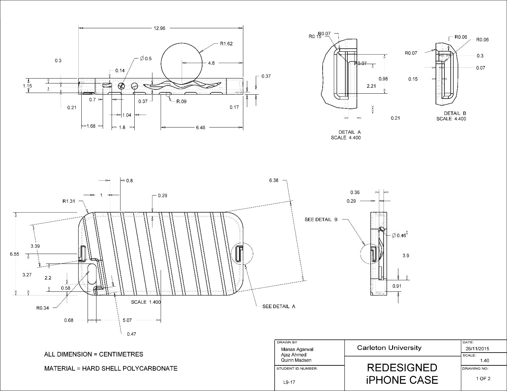
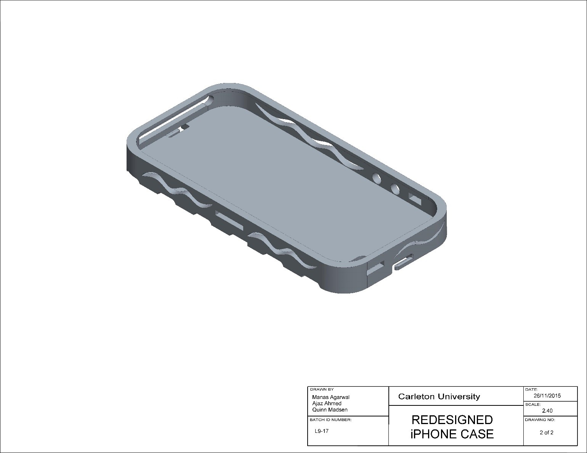

# Redesigned-iPhone-Case

The following reverse engineering project is a part ECOR1010 course Fall2015 at Carleton University, Ottawa, Canada. 
This resporitory only contains the .stl file which have the CAD data for the above project.
If more details are required (such as project description), please email to - manas.agarwal@carleton.ca along with your reason. 

## Dimensions 1 of 2

## Dimensions 2 of 2

